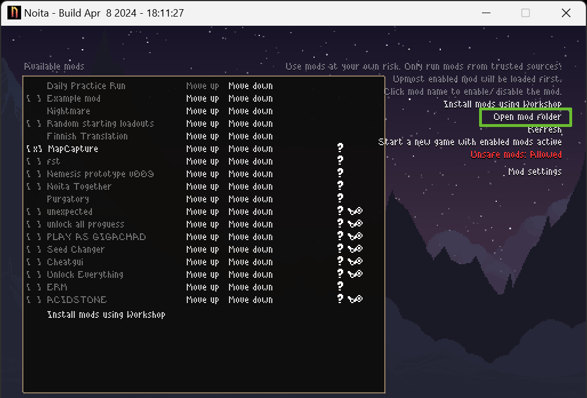
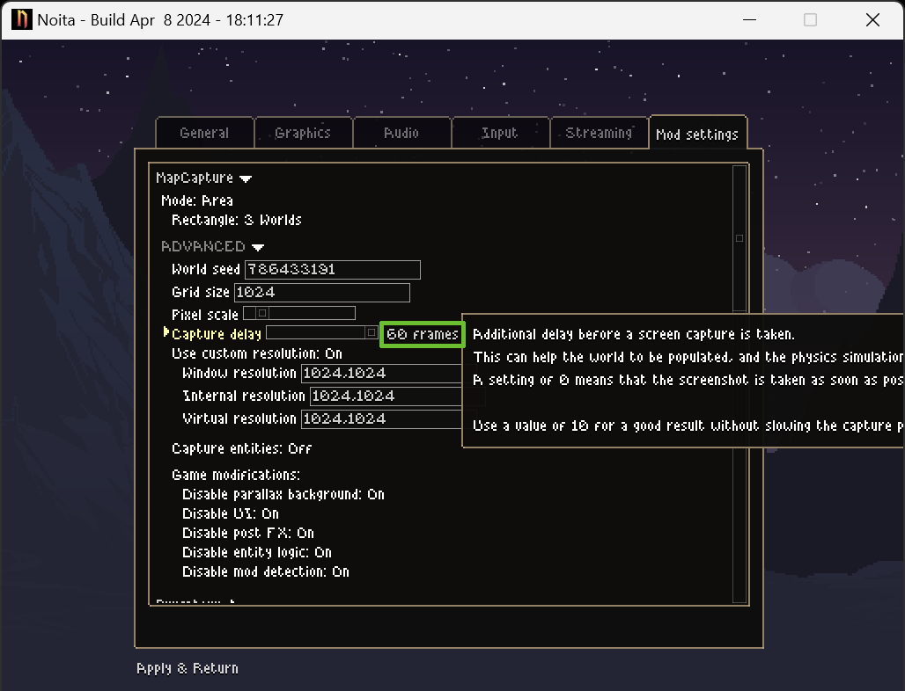
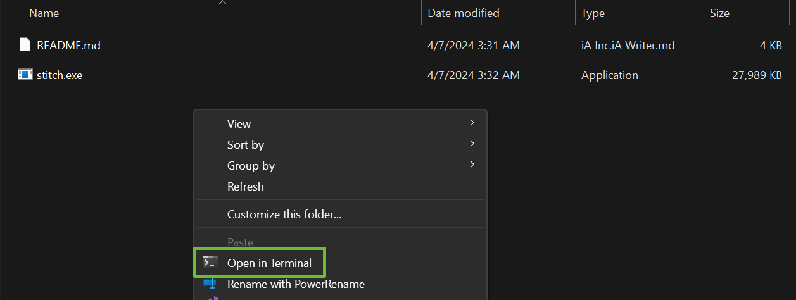
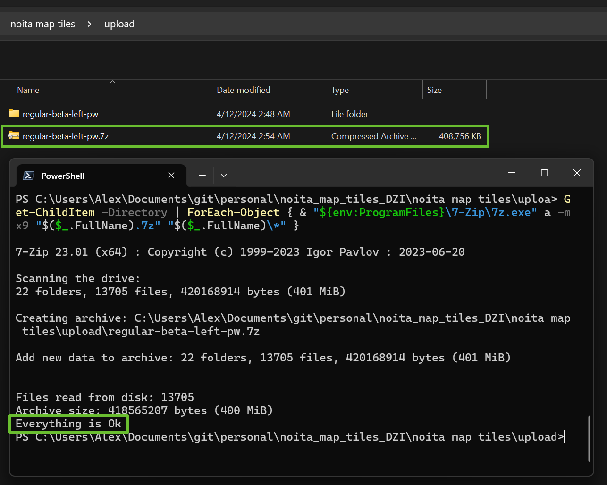

## **超快速**超缩放 Noita 地图

> 核心说明：本仓库包含视频游戏《Noita》的超高分辨率、高性能地图源码。Noitamap 基于 [OpenSeadragon](https://github.com/openseadragon/openseadragon) 开发。
>
> 本仓库最初是 whalehub 仓库的复刻版本，该原仓库已从 GitHub 移除，但我们幸运地保留了一个[更新版本的复刻](https://github.com/quiddity-wp/noita-map-viewer)—— 其中包含 OpenSeadragon 的更新版本，且可能采用了不同的 “金字塔式”（可缩放）瓦片生成算法。我的目标是打造最佳的地图浏览体验。

[地图本身](https://noitamap.com/) 由 Cloudflare Pages 托管，直接从本仓库部署。

------

## 哪里可以找到源瓦片文件？

所有当前的地图捕获文件均以独立的 `7z` 压缩包形式备份，可在共享的 [Google 云端硬盘文件夹](https://drive.google.com/drive/folders/10oSm9NOv0mdWT98tWDB-97nuP_gp1qQz) 中获取。

我们捕获地图时使用的种子码为 `786433191`，该种子包含多个可见的结构和隐藏内容。如果你发现包含更多内容的种子码，欢迎提交 issue！

------

## 我想帮忙，能做些什么？

如果你是**开发者**，欢迎贡献代码和参与讨论，可直接提交 PR 和 issue。可查看 [项目面板](https://github.com/orgs/acidflow-noita/projects/1) 了解当前进展。

如果你是**玩家**，可通过以下方式助力：捕获某一游戏模式或模组的新版本地图（网站上会标注随时间显著变化的地图日期），拼接地图后将压缩包上传至 Google Drive、PixelDrain、Gofile 等文件分享平台，再提交 issue 即可。此外，你也可以将地图界面翻译成你的母语，或在叠加层中添加更多兴趣点（后续开发周期将为无法提交 PR 的用户提供更便捷的贡献渠道）。

### 如何捕获地图

1. 从 [noita-mapcap](https://github.com/Dadido3/noita-mapcap/releases/latest) 下载最新版本。
2. 解压后将 `noita-mapcap` 文件夹移动到你的 Noita 模组文件夹中。
3. 打开模组文件夹的两种方式：
   - 在游戏内通过 `模组（Mods）`-->`打开模组文件夹（Open mod folder）` 进入。
   - 直接打开以下路径：

```powershell
C:\Program Files (x86)\Steam\steamapps\common\Noita\mods\
```



开始捕获前，请确认所有模组设置正确：选择 “3 个世界（3 Worlds）” 捕获模式，设置 “60 帧（60 frames）” 捕获延迟，种子码填写 `786433191`。除了非标准地图尺寸的模组（如替代生物群系）外，其他设置需与下图完全一致：



------

### 如何拼接地图

1. 进入 “拼接工具（Stitcher）” 目录，路径如下：

```powershell
C:\Program Files (x86)\Steam\steamapps\common\Noita\mods\noita-mapcap\bin\stitch
```

1. 在该目录内右键点击，选择 “在终端中打开（Open in Terminal）”

   

2. 复制以下命令粘贴到终端（可使用 `Ctrl+V` 或鼠标右键粘贴），**暂不执行**—— 需先按命名规则修改输出文件名：`游戏模式-分支-世界-更新日期-种子码.dzi`（示例：`常规-主分支-左侧-2024-04-08-78633191.dzi`）

```powershell
.\stitch.exe --output regular-main-branch-left-2024-04-08-78633191.dzi --blend-tile-limit 1 --dzi-tile-size 512 --xmin -53760 --xmax -17408 --ymin -31744 --ymax 41984 --webp-level 9 && .\stitch.exe --output regular-main-branch-middle-2024-04-08-78633191.dzi --blend-tile-limit 1 --dzi-tile-size 512 --xmin -17920 --xmax 18432 --ymin -31744 --ymax 41984 --webp-level 9 && .\stitch.exe --output regular-main-branch-right-2024-04-08-78633191.dzi --blend-tile-limit 1 --dzi-tile-size 512 --xmin 17920 --xmax 53760 --ymin -31744 --ymax 41984 --webp-level 9
```

linux:

```
./stitch.exe \
--output regular-main-branch-left-2024-08-12-78633191.dzi \
--blend-tile-limit 1 \
--dzi-tile-size 512 \
--xmin -53760 \
--xmax -17408 \
--ymin -31744 \
--ymax 41984 \
--webp-level 9 \
&& \
./stitch.exe \
--output regular-main-branch-middle-2024-08-12-78633191.dzi \
--blend-tile-limit 1 \
--dzi-tile-size 512 \
--xmin -17920 \
--xmax 18432 \
--ymin -31744 \
--ymax 41984 \
--webp-level 9 \
&& \
.\stitch.exe \
--output regular-main-branch-right-2024-08-12-78633191.dzi \
--blend-tile-limit 1 \
--dzi-tile-size 512 \
--xmin 17920 \
--xmax 53760 \
--ymin -31744 \
--ymax 41984 \
--webp-level 9
```

windows:

```
.\stitch.exe ^
--output regular-main-branch-left-2024-08-12-78633191.dzi ^
--blend-tile-limit 1 ^
--dzi-tile-size 512 ^
--xmin -53760 ^
--xmax -17408 ^
--ymin -31744 ^
--ymax 41984 ^
--webp-level 9

.\stitch.exe ^
--output regular-main-branch-middle-2024-08-12-78633191.dzi ^
--blend-tile-limit 1 ^
--dzi-tile-size 512 ^
--xmin -17920 ^
--xmax 18432 ^
--ymin -31744 ^
--ymax 41984 ^
--webp-level 9

.\stitch.exe ^
--output regular-main-branch-right-2024-08-12-78633191.dzi ^
--blend-tile-limit 1 ^
--dzi-tile-size 512 ^
--xmin 17920 ^
--xmax 53760 ^
--ymin -31744 ^
--ymax 41984 ^
--webp-level 9
```

1. 执行命令后，拼接完成时会在 `stitch.exe` 同级目录下生成 3 个新文件夹（`游戏模式-分支-世界-更新日期-种子码_files`）和 3 个新文件（`游戏模式-分支-世界-更新日期-种子码.dzi`）。

------

### 如何分享捕获结果以添加到 Noitamap

1. 新建一个文件夹（例如命名为 `upload`），在其中创建子文件夹并按规则命名（`游戏模式-分支-世界-更新日期`），将拼接结果移动到该子文件夹中。

2. 生成最高压缩级别（9 级）的`7z`

   压缩包：

   - 手动操作：右键点击子文件夹，选择 “7-zip”-->`添加到压缩包`，选择 `7z` 格式和 “9 - 极限压缩（Ultra）” 级别。
   - 命令行操作：在 `upload` 文件夹内打开 Windows 终端，执行以下命令：

```powershell
Get-ChildItem -Directory | ForEach-Object { & "${env:ProgramFiles}\7-Zip\7z.exe" a -mx9 "$($_.FullName).7z" "$($_.FullName)\*" }
```



1. 将生成的 `7z` 压缩包上传到你常用的文件分享平台（Google Drive、Mega、PixelDrain、Gofile 等）。
2. 提交一个带有 `new-map-capture` 标签的新 issue，提供地图相关详情并附上下载链接。

------

## 致谢

特别感谢 [@Dadido3](https://github.com/Dadido3)、[@myndzi](https://github.com/myndzi)、[@Acors24](https://github.com/Acors24) 和 [@dextercd](https://github.com/dextercd) 的付出、帮助和建议！感谢 [Arganvain](https://www.twitch.tv/arganvain) 修改了我最初制作的 Logo，感谢 Discord 用户 wand_despawner 捕获了多张地图，感谢 Discord 用户 hey_allen 为地图瓦片的灾难恢复提供了存储空间，感谢 Discord 用户 Bohnenkrautsaft 提议添加地图加载指示器、重构了指示器代码，并贡献了其他代码修复和功能优化！
